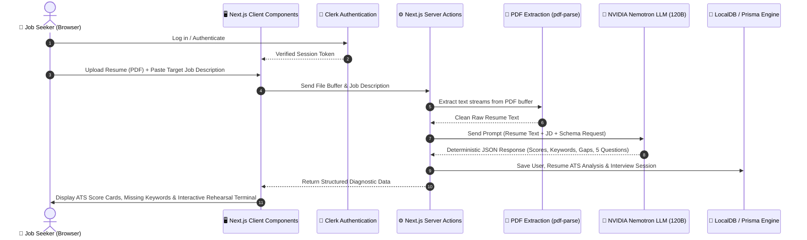

# 01. Project Overview & Architecture

## 💡 What Problem Does This Project Solve?

When applying for software engineering and tech jobs:
1. **Applicant Tracking Systems (ATS)** filter out resumes before a human recruiter ever sees them. If a resume lacks required keywords or clear technical achievements, it gets rejected.
2. **Generic AI tools** give vague, generic feedback and lack real interview simulation.
3. **Candidates struggle with technical interviews** because they don't know what questions will be asked based on their specific experience gaps.

### 🚀 The Solution: Nemotron ATS
**Nemotron ATS** is a full-stack, AI-powered engineering workbench that:
1. **Reads & extracts text** from your PDF resume securely on the server.
2. **Compares your resume against a specific target Job Description (JD)**.
3. **Calculates a precise ATS Score (0–100)** across multiple dimensions (Keyword Coverage, Experience Scope, Technical Depth).
4. **Highlights Missing Keywords & Skill Gaps** organized into clear taxonomies (Languages, Cloud/DevOps, Databases, Architecture).
5. **Formulates 5 custom technical interview scenarios** targeting your weak spots with a live voice-interactive rehearsal terminal (voice-to-text, live stopwatch, and speaking speed tracking).

---

## 🏗️ Visual System Architecture & Flow

---

## 🔄 End-to-End User Journey (Step-by-Step)

### Step 1: Authentication & Session Protection
- When you open the application, **Clerk** manages user login and authentication.
- Unauthenticated users can view the marketing page; logging in unlocks the full diagnostic workbench.

### Step 2: Resume Ingestion & Validation
- The user drags and drops a PDF resume (or clicks the **Alex Mercer Sample Resume Loader** for instant testing).
- The file is verified (MIME type check, file size $< 5\text{MB}$).
- The server extracts clean text using `pdf-parse` without leaking data to third parties.

### Step 3: Job Description Pairing & AI Inference
- The user inputs the job description for their desired role.
- Next.js server sends both the resume text and the job description to the **NVIDIA Nemotron AI model**.
- The AI acts as a **Principal Staff Engineer & Hiring Manager**, rigorously rating the candidate against the job requirements.
- The AI's response is validated using **Zod schemas** to ensure zero runtime errors.

### Step 4: Diagnostic Dashboard Presentation
- The user receives an immediate visual breakdown:
  - **ATS Score Gauge (0–100)**
  - **Sub-Scores**: Keyword Coverage %, Experience Scope %, Technical Depth %
  - **Keyword Taxonomy**: Matched vs. Missing technologies
  - **Identified Gaps & Core Strengths**

### Step 5: Live Technical Interview Terminal
- The user navigates to the **Interview Terminal**.
- 5 custom questions generated specifically around the candidate's gaps are presented.
- The user can practice speaking using the **Microphone (Web Speech API)**, with real-time **Words Per Minute (WPM)** pace telemetry, stopwatch, and answer rubrics.
