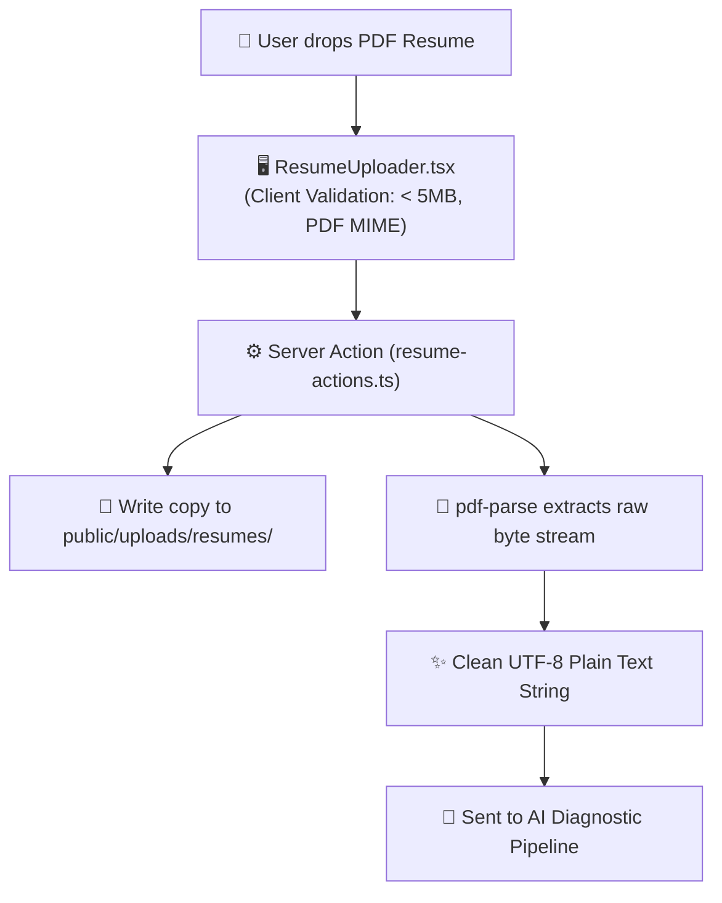
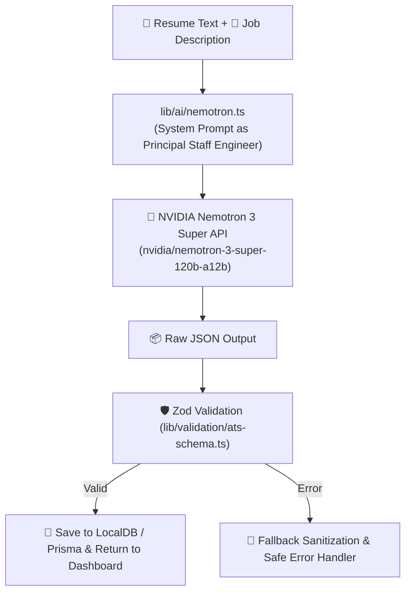
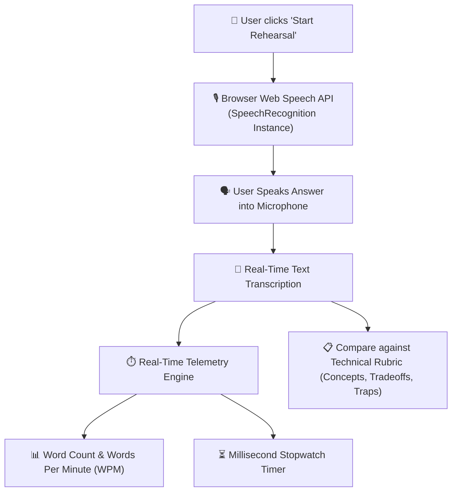

# 04. How Features Work Under The Hood (Deep Dive)

This document breaks down the three core technical pipelines of the application step-by-step.

---

## 🛠️ Pipeline 1: PDF Resume Ingestion & Parsing

### 1. Client-Side Dropzone
- In `components/ResumeUploader.tsx`, HTML5 drag-and-drop events (`onDragOver`, `onDrop`) capture the PDF file.
- The file type is verified to ensure it is `application/pdf` and under the 5MB size limit.

### 2. Server-Side Extraction
- The file is converted into a `Buffer` and passed to `pdf-parse`.
- `pdf-parse` extracts character streams, cleans up irregular line breaks, and returns a sanitized plain-text string containing the candidate's work history, skills, and education.

---

## 🧠 Pipeline 2: AI Diagnostic Engine & Structured JSON Enforcement

### 1. The Prompt Engineering Strategy
The AI is given a strict system prompt instructing it to act as an unforgiving **Principal Staff Engineer & Hiring Committee Lead**. It receives:
1. The **Candidate Resume Text**.
2. The **Target Job Description**.
3. A strict JSON output specification.

### 2. Output Schema
The AI calculates:
- **`atsScore`** (0–100): Calculated from 3 weighted components:
  - *Keyword Match Coverage (40%)*
  - *Experience Scope Alignment (30%)*
  - *Technical Depth Rating (30%)*
- **`keywordTaxonomy`**: Breakdown of matched vs. missing tools across 5 technical categories.
- **`skillGaps`**: Specific high-impact architectural deficiencies.
- **`coreStrengths`**: Verified technical competencies.
- **`interviewQuestions`**: Exactly 5 scenario-based technical questions.

### 3. Zod Schema Guarantee
Before any data is returned to the frontend, Zod executes `atsResponseSchema.parse(json)`. This guarantees that:
- Every score is a number between 0 and 100.
- All lists and arrays exist and are non-null.
- No unexpected keys or malformed JSON can break the React UI.

---

## 🎙️ Pipeline 3: Live Voice Rehearsal & Telemetry

### 1. Browser Speech-to-Text
In `components/InterviewTerminal.tsx`:
- The browser checks for `window.SpeechRecognition` or `window.webkitSpeechRecognition`.
- When the user starts speaking, audio frames are converted to text in real time with continuous recognition (`recognition.continuous = true`).

### 2. Live Telemetry Calculation
- **Elapsed Time**: A `setInterval` timer measures practice time with millisecond precision.
- **Speaking Pace (WPM)**: The application calculates speaking speed:
  $$\text{WPM} = \frac{\text{Total Words Transcribed}}{\text{Elapsed Minutes}}$$
  - Ideal technical interview pace is **120 – 160 WPM**.
  - The UI indicates if you are speaking too fast (rushed) or too slow (hesitant).

### 3. Engineering Rubric
Each generated question includes:
- **Essential Concepts**: Keywords the interviewer expects to hear (e.g., *Idempotency, WAL, Backpressure*).
- **Architectural Tradeoffs**: Balance of latency vs. consistency vs. throughput.
- **Common Traps / Anti-patterns**: Mistakes junior engineers make during technical interviews.
