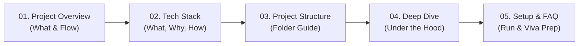

# 📚 Beginner's Documentation Hub — Nemotron ATS Resume Analyzer

Welcome to the **Beginner-Friendly Documentation** for the **Nemotron ATS AI Resume Analyzer & Technical Interview Workbench**!

Whether you are a beginner programmer, a student reviewing this project, an interviewer, or a collaborator, these guides break down **every single concept, library, and line of architecture** into simple, plain English.

---

## 🗺️ Documentation Roadmap

Here is the recommended reading order:

| # | Guide | Description |
|---|---|---|
| 🎓 | [**Zero-to-Hero Self-Learning Masterclass**](./SELF_LEARNING_GUIDE.md) | **Start here if you want to learn!** Step-by-step tutorial modules, code analogies, and hands-on mini challenges. |
| **01** | [**Project Overview & Architecture**](./01_PROJECT_OVERVIEW.md) | What this project does, why it was built, and the visual data-flow diagram. |
| **02** | [**Tech Stack Explained (What, Why, How)**](./02_TECH_STACK_EXPLAINED.md) | Detailed breakdown of every tool (Next.js, Clerk, Prisma, NVIDIA AI, Tailwind, etc.). |
| **03** | [**Folder & File Structure Guide**](./03_PROJECT_STRUCTURE.md) | Explains what every directory (`app/`, `components/`, `actions/`, `lib/`) does. |
| **04** | [**How Features Work Under The Hood**](./04_HOW_IT_WORKS_DEEP_DIVE.md) | Deep dive into PDF Parsing, AI ATS Scoring, and the Voice Interview Terminal. |
| **05** | [**Beginner's Setup & Viva / Interview Cheat Sheet**](./05_BEGINNERS_SETUP_AND_FAQ.md) | How to run the app step-by-step, common troubleshooting, and Q&A for project reviews. |

---

## 🎯 Quick 30-Second Summary

- **What is this?** A web app where job seekers upload their resume and paste a job description. 
- **What does AI do?** An AI model (**NVIDIA Nemotron 3 Super**) scans the resume, calculates an ATS Score (0-100), points out missing keywords/gaps, and generates 5 custom technical interview practice questions.
- **Bonus Feature:** An interactive interview simulator that records your voice using speech-to-text, measures your speaking speed (Words Per Minute), and times your answers.
