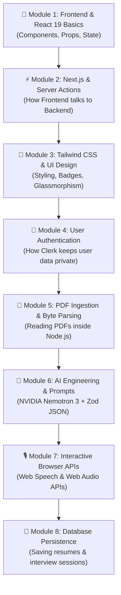

# 🎓 Zero-to-Hero Self-Learning Masterclass: AI Resume Analyzer

Welcome! This guide is designed **specifically for you to learn full-stack web development and AI engineering** using this project as your personal learning playground.

If you are a beginner, don't worry! Everything is explained using simple analogies, step-by-step concepts, and beginner-friendly code explanations.

---

## 🗺️ Your Step-by-Step Learning Curriculum



---

## 📘 Module 1: The React Mental Model (Building Blocks)

### 💡 What is a Component?
Think of a website like a **Lego set**. Instead of writing one huge 2000-line HTML file, you build small reusable Lego blocks called **Components**.
- `AtsScoreCard.tsx` = The Lego block that shows the circular score.
- `KeywordList.tsx` = The Lego block that shows keyword badges.
- `InterviewTerminal.tsx` = The Lego block for the interview simulator.

### 💡 What is `useState`? (Memory of a Component)
`useState` is how a component remembers things that change over time (like user input, a stopwatch counter, or whether the microphone is on).

```tsx
// Example from InterviewTerminal.tsx
const [isRecording, setIsRecording] = useState(false);
```
- `isRecording`: The current value (`true` or `false`).
- `setIsRecording`: The function you call when you click the microphone button to change the state.
- When state changes, **React automatically redraws the screen!**

---

## ⚡ Module 2: Next.js & Server Actions (Frontend $\leftrightarrow$ Backend)

### 💡 Traditional Way vs Next.js Server Actions
* **Traditional Way**: You write an Express.js server, define `app.post('/api/analyze')`, configure CORS, and write `fetch('/api/analyze')` on the frontend.
* **Next.js Server Actions (What this project uses)**: You write a regular TypeScript function with `"use server"` at the top! You can call it directly from your button click just like a normal function.

```tsx
// Inside actions/resume-actions.ts
"use server"; // Tells Next.js: "Run this code ONLY on the server, NEVER leak it to the browser"

export async function uploadAndParseResume(formData: FormData) {
  const file = formData.get("resume") as File;
  const buffer = Buffer.from(await file.arrayBuffer());
  const text = await parsePdfBuffer(buffer);
  return { success: true, text };
}
```

---

## 🎨 Module 3: Modern UI with Tailwind CSS

Instead of writing separate `.css` files, Tailwind allows you to style elements directly in your JSX classes:

* `bg-slate-900` $\rightarrow$ Dark background color.
* `text-emerald-400` $\rightarrow$ Vibrant green text color for high scores.
* `flex items-center justify-between` $\rightarrow$ Flexbox alignment in 3 words.
* `rounded-xl border border-slate-800` $\rightarrow$ Smooth rounded corners with a subtle modern border.
* `backdrop-blur-md bg-slate-900/50` $\rightarrow$ Futuristic translucent frosted-glass effect.

---

## 🔐 Module 4: Authentication with Clerk

### 💡 Why do we need Auth?
We don't want User A to see User B's uploaded resume or interview notes.

### How it works in this project:
1. **`middleware.ts`**: Checks every incoming page request. If someone tries to open `/dashboard` without logging in, it automatically redirects them to the login screen.
2. **`layout.tsx`**: Wraps the entire app in `<ClerkProvider>`, giving every page instant access to the logged-in user's profile and avatar.

---

## 📄 Module 5: How PDF Files Turn into Text

PDF files are not plain text files; they are binary files containing geometric instructions (fonts, coordinates, compressed vector streams).

### The Ingestion Pipeline:
1. User drops a PDF file in `components/ResumeUploader.tsx`.
2. The browser sends the raw file bytes to `actions/resume-actions.ts`.
3. Node.js uses `pdf-parse` to convert the binary stream into a clean string:
   ```ts
   import pdfParse from "pdf-parse";
   
   const data = await pdfParse(pdfBuffer);
   console.log(data.text); // "Alex Mercer - Senior Full Stack Engineer..."
   ```

---

## 🧠 Module 6: AI Prompting & Structured Data (NVIDIA Nemotron + Zod)

### 💡 The Prompt Formula
In `lib/ai/nemotron.ts`, we give the AI three things:
1. **Role**: *"You are an unforgiving Principal Staff Engineer and ATS System."*
2. **Context**: The candidate's extracted resume text + the target job description.
3. **Format Contract**: *"You MUST respond ONLY in valid JSON matching this exact structure."*

### 💡 Why Zod is Your Best Friend
LLMs can occasionally output missing fields. We protect our app using **Zod**:
```ts
// lib/validation/ats-schema.ts
export const atsResponseSchema = z.object({
  atsScore: z.number().min(0).max(100),
  coreStrengths: z.array(z.string()),
  skillGaps: z.array(z.string()),
  // ...
});
```
If the AI ever returns a score of `"ninety"` (a string) instead of `90` (a number), Zod immediately catches the mismatch and prevents runtime UI crashes.

---

## 🎙️ Module 7: Web Speech & Web Audio APIs

### 1. Web Speech API (`SpeechRecognition`)
- Runs **100% inside your browser** (Chrome / Edge / Safari) for free.
- As you speak into your microphone, the browser emits `onresult` events with text chunks.
- We count the words and divide by time elapsed to calculate your **Speaking Pace (WPM)**!

### 2. Web Audio API (`lib/sound.ts`)
- Rather than loading large `.mp3` files, we use code to oscillate sound waves directly in your computer's sound card:
  ```ts
  const ctx = new AudioContext();
  const osc = ctx.createOscillator();
  osc.frequency.setValueAtTime(440, ctx.currentTime); // 440 Hz = musical note A
  osc.start();
  ```

---

## 💾 Module 8: Database Persistence (LocalDB & Prisma)

Instead of forcing you to sign up for cloud database accounts or install PostgreSQL/Docker:
- Data is stored locally in `.data/db.json`.
- The database helpers in `lib/db/` provide an ORM-style interface:
  - `saveResumeAnalysis(userId, result)`
  - `getResumeHistory(userId)`
  - `saveInterviewNotes(sessionId, notes)`

---

## 🛠️ Hands-On Learning Exercises (Try These!)

To build your practical coding skills, try making these small modifications yourself:

### 🌟 Challenge 1: Customize the Score Colors
Open [components/AtsScoreCard.tsx](file:///f:/meowmeow90/components/AtsScoreCard.tsx):
- Look for where the score color is calculated (e.g. `>= 80` is emerald green, `< 60` is amber/rose).
- Try tweaking the score thresholds or color gradients to your favorite colors!

### 🌟 Challenge 2: Add a New Preset Job Description
Open [components/JobDescriptionInput.tsx](file:///f:/meowmeow90/components/JobDescriptionInput.tsx):
- Look for the preset buttons (e.g., "Senior Full-Stack", "AI/ML Engineer").
- Add your own preset job description (e.g. "DevOps Engineer" or "Mobile React Native Dev")!

### 🌟 Challenge 3: Modify the Interview Timer
Open [components/InterviewTerminal.tsx](file:///f:/meowmeow90/components/InterviewTerminal.tsx):
- Check how `timer` and `wpm` are calculated in the `useEffect`.
- Add an alert badge if the candidate speaks for longer than 3 minutes.
